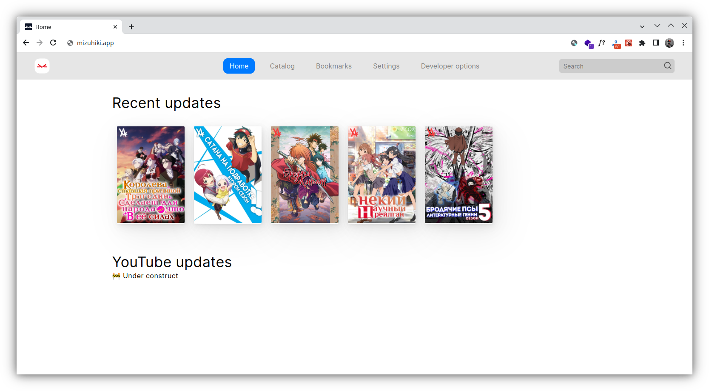

# A-Frame

A-Frame - Open Source & modern AniLibria API web client.

<!--  -->

## 🚀 Features

When creating A-Frame, we aimed to achieve the best web application experience and for this purpose we are implementing the following features:

1. ✅ 100% Support the original API
1. 🌐 Support multiple translations and internalization
1. ⛔ Free of telemetry and advertising
1. 🧩 Completely free license
1. ⚙️ Use modern frameworks and libraries
1. 🧰 Use features of modern browsers, including PWA and Web-Workers

### 🔬 Development process

Since we believe that the main problems of Open Source are burnout and lack of documentation, we are taking the following steps:

#### 🥊 Fighting burnout

To solve the problem of burnout, we support active feedback from developers to the community, report on all even minor updates, so that developers can see that their work is paying off, including in the form of feedback from users.

#### 🥊 Fighting "documentation"

The problem preventing an open source project from developing is often the lack of documentation for developers to help them understand the project code, as well as the lack of guidance for contributors. Because of this, people who would like to contribute to the project cannot do so because they have no clear instructions on how they can propose fixes or functionality to the project. We try to remedy this by providing both source code documentation, including a list of the components used, and a contributor guide from which developers can learn how to suggest changes to the project.

## 🗺️ Roadmap

## 🧙 Community

In the end any program is created with the purpose to make human life easier and more pleasant, A-Frame is no exception, you can join our friendly community in Discord[🇷🇺]. However, remember the rules of behavior accepted in our community, this is not the place where you can find out personal relationships.

## 💫 Guides for contributors

> WIP

## Associative projects

* [Metaform](https://github.com/maxqwars/metaform) - Open Source modern AniLibria rest API library for JavaScript applications
