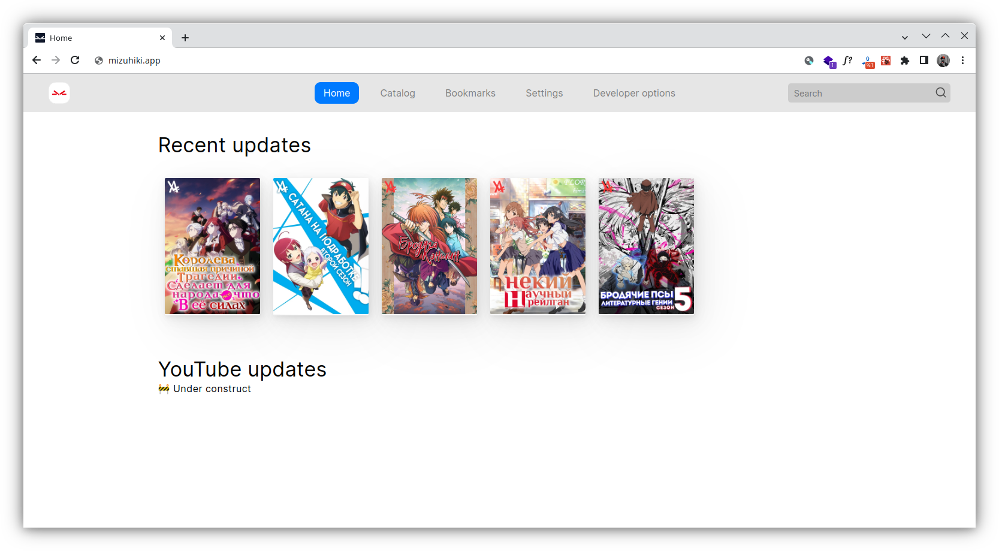

<!--  -->

# Mizuhiki

Mizuhiki - Open Source & modern AniLibria API web client.

## 🚀 Features

1. Work on any modern browsers
2. Internalization support
3. Fast and easy deployment (thanks `Docker`)
4. No telemetry and no advertising
5. Fullest `PWA` feature support: cache, system integration

## Community

<!-- TODO: Create Discord server -->

## 🔨 Contributing

> WIP

## 📦 Deployment

> WIP
